# GhostLens — Spécification & Architecture Système (v1.0)

## 1. Vue d'ensemble & Mission
GhostLens est une extension de navigateur Chromium (Manifest V3) garantissant une détection et une analyse locale, en temps réel et respectueuse de la vie privée du contenu généré par IA (textes, images, sites *vibe-coded*), avec capacités d'humanisation et de filtrage/blocage interactif.

### Principes Directeurs
1. **100% Local (C-1, C-7)** : Aucune donnée textuelle ou visuelle ne quitte la machine de l'utilisateur. Zéro télémétrie, zéro analytique, zéro CDN runtime.
2. **Extraction Zéro-Erreur (C-3)** : Le texte d'analyse est strictement délimité au contenu éditorial via mozilla/readability et des hard-filters (exclusion nav, headers, footers, bannières cookies, mentions légales).
3. **Explicabilité Totale (C-5, C-10)** : Chaque verdict est probabiliste et décomposé en signaux quantifiables (valeur brute, poids effectif, contribution, temps d'exécution).
4. **Human-in-the-loop (C-9)** : Jamais de destruction silencieuse ; tout blocage propose un écran de verrouillage explicite et des options de déblocage temporaires ou permanentes.

---

## 2. Diagramme des Flux & Architecture Multi-Processus

```mermaid
flowchart TB
    subgraph Page["Page Web (DOM)"]
        DOM[DOM de la Page]
        CS_Capture["Content Script: Capture & Adapters"]
        CS_Extract["Readability + Hard Filters"]
        CS_Norm["Normalisation NFC & Homoglyphes"]
        ShadowBadge["Closed Shadow Root: Badge"]
        ShadowBlock["Closed Shadow Root: Écran Verrou"]
        ShadowHighlight["DOM Highlight Phrases"]
    end

    subgraph SW["Background (Service Worker MV3)"]
        Router["Orchestrateur & Routeur IPC"]
        IDBCache[("IndexedDB: Analyses & Modèles")]
        SettingsStore[("Paramètres & Exceptions")]
        FusionEngine["Moteur de Fusion & Règles Dures"]
    end

    subgraph Workers["Inférence Locale (Web Workers / Offscreen)"]
        WorkerA["Worker A: ONNX WebGPU / WASM<br>(D1 Classifieur Profond, D2 fastText)"]
        WorkerB["Worker B: Heuristiques & Stats<br>(D3 Compression LZMA, D4 Burstiness, D5 Stats, D6 Slop, D7 Patterns)"]
        WorkerImg["Worker C: Analyse Image<br>(I1 C2PA, I2 DCT Fréquence, I3 ONNX Image)"]
        WorkerAdv["Worker D: Advanced / D8 Watermark<br>(gl-wm-scorer ONNX INT4)"]
    end

    subgraph UI["Interface Utilisateur (React + Astryx)"]
        SidePanel["Side Panel (Rapport Détaillé & Humanizer)"]
        Popup["Popup Rapide"]
        Options["Options & Gestionnaire de Modèles"]
    end

    subgraph Host["Native Messaging Host (Optionnel)"]
        NodeHost["Node.js Host (Binoculars, DetectGPT, Plagiat Local)"]
    end

    %% Flux d'exécution
    DOM --> CS_Capture
    CS_Capture --> CS_Extract
    CS_Extract --> CS_Norm
    CS_Norm -- "gl:analyze (texte nettoyé)" --> Router

    Router <--> IDBCache
    Router <--> SettingsStore

    Router -- "Dispatch Parallèle" --> WorkerA
    Router -- "Dispatch Parallèle" --> WorkerB
    Router -- "Scan Images" --> WorkerImg
    Router -. "Si activé" .-> WorkerAdv
    Router -. "Si host installé" .-> NodeHost

    WorkerA --> FusionEngine
    WorkerB --> FusionEngine
    WorkerImg --> FusionEngine
    WorkerAdv --> FusionEngine
    NodeHost --> FusionEngine

    FusionEngine --> Router

    Router -- "gl:result" --> ShadowBadge
    Router -- "gl:block" --> ShadowBlock
    Router -- "gl:highlight" --> ShadowHighlight
    Router -- "gl:open / gl:result" --> SidePanel
    Router -- "gl:result" --> Popup
```

---

## 3. Décomposition des Modules

### 3.1 Content Script & Extraction Zéro-Erreur
- **Capture** : Détecte en priorité `window.getSelection()` (si $\ge 20$ mots), sinon capture le DOM visible en appliquant les adaptateurs spécifiques (Gmail, X, LinkedIn, YouTube, GitHub, Facebook, Google Docs).
- **Readability + Hard-Filters** :
  1. Clone le document (`document.cloneNode(true)`).
  2. Supprime `<script>`, `<style>`, `<noscript>`, `<iframe>`.
  3. Parse via `Readability`.
  4. Applique des filtres stricts par regex et densité de liens sur les résidus de navigation (cookies, mentions légales, pagination, footer).
- **Normalisation** : NFC Unicode, substitution des homoglyphes (anti-contournement), réduction des espaces tout en conservant la ponctuation sémantique.
- **Isolation CSS** : Injection du badge et de l'écran de verrouillage dans des *Closed Shadow Roots* (`attachShadow({ mode: 'closed' })`) pour éviter toute interférence avec le CSS hôte.

### 3.2 Signaux de Détection du Texte
- **D1 — Classifieur Profond (ONNX INT8)** : Modèle Transformer distillé bilingue (FR/EN) exécuté via WebGPU / fallback WASM multithread.
- **D2 — fastText Supervisé (WASM/ONNX)** : Modèle compact n-grams fournissant une probabilité et le top-5 des n-grams d'explicabilité.
- **D3 — Compression (LZMA / Deflate)** : Ratios de compressibilité sur texte brut et déponctué (le texte généré par IA présente une entropie plus faible).
- **D4 — Burstiness & Variance** : Calcul de la variance inter-phrases des longueurs de tokens et de mots.
- **D5 — Statistiques Textuelles** : TTR (*Type-Token Ratio*), diversité de trigrammes, ratio d'hapax legomena, lisibilité Flesch.
- **D6 — AI-isms & Slop List** : Densité normalisée de lexiques et collocations surreprésentés dans les sorties LLM (listes FR & EN).
- **D7 — Patterns Rhétoriques** : Détection des constructions antithétiques récurrentes (« Pas seulement X, mais Y »), transitions stéréotypées et intros clichés.
- **D8 — Watermarking & Attribution (Avancé)** : Détection KGW / Unigram / SWEET via z-score sous $H_0$, et décodage multi-bits CredID.
- **D9 — Fluidité & Anomalies Grammaticales** : Détection de perfection artificielle et support du serveur LanguageTool local (localhost:8010).
- **D10 — Plagiat Local (SimHash / MiniHash)** : Détection de chevauchement sur base locale et historique de navigation.
- **D11 — Site Vibe-Coded** : Analyse structurelle du DOM (signatures de générateurs v0, Bolt, Lovable, frameworks, lorem ipsum, templates).

### 3.3 Module Images (I1 à I4)
- **I1 — Métadonnées & C2PA** : Analyse des métadonnées EXIF/ICC et validation des assertions C2PA Content Credentials.
- **I2 — Artefacts de Fréquence** : Analyse spectrale DCT par blocs 8x8/16x16 pour détecter les grilles d'échantillonnage de diffusion/GAN.
- **I3 — Classifieur ONNX Image** : Inférence locale directe sur `<canvas>` normalisé (224x224).
- **I4 — Fusion & Badge Image** : Mini-pilule incrustée dans le conteneur shadow de chaque image $\ge 64\times 64\text{ px}$.

### 3.4 Module Humanizer (H1 à H5)
- **H1 (Purge Slop)** : Remplacement ciblé des n-grams détectés par des alternatives idiomatiques.
- **H2 (Restructuration)** : Rétablissement de la burstiness (fractionnement des phrases longues, variation de rythme, conversion de listes).
- **H3 (LLM Local Optionnel)** : Modèle 1B–4B INT4 exécuté localement avec instructions rigides de préservation sémantique et factuelle.
- **H4 (Finition Typographique)** : Correction d'espaces insécables, guillemets et accords.
- **H5 (Vérification Stricte)** : Re-calcul du score IA, calcul de similarité sémantique MiniLM ($\ge 0.85$) et vérification d'invariance des entités et valeurs numériques (rollback automatique si altération).

---

## 4. Matrice des Protocoles de Communication (IPC)

| Type de Message | Émetteur | Destinataire | Payload principal |
|---|---|---|---|
| `gl:analyze` | Content Script | Background | `{ id, kind, source, url, text, image, adapter }` |
| `gl:result` | Background | Content Script / UI | `AnalysisResult` (score, signaux, phrases, images) |
| `gl:open` | Background / CS | Side Panel | `{ analysisId }` |
| `gl:block` | Background | Content Script | `{ pageScore, vibeScore, decision, reason }` |
| `gl:unblock` | Content Script / UI | Background | `{ domain, scope: 'page'\|'hour'\|'always' }` |
| `gl:humanize` | Side Panel / CS | Background | `{ text, selectionOnly, options }` |
| `gl:humanize:result` | Background | Side Panel | `{ before, after, diff, similarity, factualIntegrity }` |

---

## 5. Spécifications de Stockage (IndexedDB `ghostlens`)
- `analyses` : Clé `sha256(text) + ':' + modelsVersion` $\rightarrow$ `AnalysisResult` + `timestamp` + `url`.
- `models` : Clé `name` $\rightarrow$ `Blob` (binaire ONNX quantisé) + `sha256` + `version`.
- `settings` : Clé `'app'` $\rightarrow$ `SettingsSchema` (seuils, poids, modes, consentement).
- `exceptions` : Clé `domain` $\rightarrow$ `{ domain, scope, until, reason }`.
- `docIndex` : Clé `docId` $\rightarrow$ Empreintes SimHash.
- `history` : Clé `analysisId` $\rightarrow$ Métadonnées d'affichage rapide pour la liste virtualisée.
